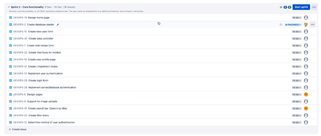
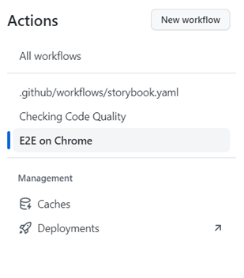

<h1 style="font-size: 300%; "> COM619 - DevOps (Development Operations) </h1>

 
 
 

<ul style="list-style: none;">
<li><b>Group Members:</b></li>
<li>Lewis Holmes</li>
<li>Alastair Cox</li>
<li>Paul Chester</li>
<li>Kain Peacock</li>
<li>Tyrone Ekhator</li>
</ul>

 
 
 
 
 

**Github URL:** [lewis-holmes-98/com619_devops (github.com)](https://github.com/lewis-holmes-98/com619_devops)  
**Hosted at:** [vercel.app](https://com619-devops.vercel.app)

# Introduction

The group has been tasked to create a full-stack recipe-sharing application using modern web development tools. Users should be able to create recipes and view recipes other users have submitted. From the scenario brief, the following requirements were generated:
| ID | Requirement Description |
|-----|---------------------------------------------------------------------|
| G1 | Guests can browse existing recipes
| G2 | Guests can create a new account (becoming a ‘User’)
| U1 | Users can login to the site
| U2 | Users can browse existing recipes
| U3 | Users can set a profile picture
| U4 | Users can update their profile
| U5 | Users can set site-wide preferences
| U6 | Users can create recipes
| U7 | Users can edit their own recipes
| U8 | Users can delete their own recipes
| R1 | Recipes can be private or public
| R2 | Recipes will consist of appropriate fields (ingredients, steps etc.)
| R3 | Recipes can be commented on
| R4 | Recipes can be liked
| NF1 | Website must serve a client in a prompt manner
| NF2 | Website must not crash unrecoverably
| NF3 | Appropriate Dev Ops tools and practices shall be used
| NF4 | Website shall be hosted using a serverless infrastructure
| NF5 | Logging shall be used where appropriate

# Project management

The first process undertaken by the group was to identify the skills of each developer. In doing so, the tasks assigned to each member can be optimised to their strengths. An agile methodology was decided upon due to the nature of the task – there is little possibility of scope creep, a clear end goal and is a relatively small project. One week sprint intervals were chosen to ensure regular check-ins with the group, securing focus over the project development lifecycle.

Jira was chosen as our issue and project tracking software, for its availability and ease of use. Similar tools were considered, such as Azure DevOps and GitHub Boards, but were eventually rejected. A discord server was used for team communication.

The first sprint was dedicated to initialising the project. Epics and user stories were created first, followed by tasks. These tasks were put into the backlog and prioritised accordingly.

A discussion about what was required for a task to be considered ‘done’ occurred. The final decision was that a task must, at a minimum, complete the required functionality and have appropriate tests.

A branch naming structure and policy was agreed upon. Branches must take the format of ‘[developer intitials]/[feature_name]’ (ex. ‘kp/sign-up-form’), allowing for easy identification of who wrote the branch and what its purpose is. Any feature branch will be based on the latest dev branch, and would be merged back into dev upon completion.

# DevOps workflow

A variety of DevOps tools and practices were used throughout the project to aid with development and production.

## Continuous Integration

A CI pipeline was integrated within the application to help with development. It provides team accountability and transparency, a robust testing pipeline, and makes updating the codebase simple.

## Linting

A linting tool was used to ensure code quality and that the appropriate coding standards were followed. Husky was chosen as it has zero dependencies and is incredibly lightweight. Linting was vital during this project to ensure uniformity between the developer’s code. This reduced the time taken during PR reviews, as the team would be confident that the code met the coding standard.

## Unit/Integration Tests

Cypress was used to perform E2E integration tests. All app functionality was tested, including logging in and creating a recipe. Due to the small amount of transformative functions, very few unit tests were included in the project. It was agreed upon that the development time required to implement unit tests was better spent elsewhere. Unit tests would provide very little benefit to the team – almost all of the functionality was tested in Cypress; any finer tests would essentially be testing against pure JavaScript, which is unnecessary. However, a single script for testing the individual components has been written, just to ensure there are no small errors if a package/library gets updated. By implementing integration tests, the development team was assured that the app would build, and the core functionality had no errors. For this reason code coverage was less of a priority, and chasing an exact percentage coverage was considered inefficient.

## Acceptance Tests

Acceptance tests were performed at the end of the project against the following stakeholder requirements, and the final results are as followed:

**Guest**
| | |
|---------------------------|--------|
| Can browse recipes listed | Passed |
| Can create a new account | Passed |

**User**
| | |
|---------------------------|--------|
| Can upload a profile picture | Passed |
| Can set global preferences (e.g., dark mode) | Passed |
| Can create, update, and delete their own recipes consisting of: <ul><li>Steps</li><li>Ingredients</li><li>Photos</li></ul> | Passed |
| Can set their recipes as private or public.| Passed |
| Can like and favorite recipes | Failed |
| Can create, update, and delete their own comments on recipes | Failed |
| Can update their profile | Passed |

Most of the acceptance tests passed. Comments can be created, but not edited or deleted. Liking and favoriting recipes is a functionality not implemented. Dark mode is handled by the browsers settings; if the browser is in dark-mode so is the site, and vice versa. Users can update their profile picture locally, but it will not be saved in the database.

## Login Provider

To avoid storing sensitive information within the app, an external login provider was used through next-auth. For this project the chosen provider was GitHub. The time that would have been taken developing an in-house login solution was spent on furthering the core functionality of the application, a much greater use of developer resources.

## Package Management

Node Package Manager (npm) was used as the package management tool. Automated dependency and package management was hugely beneficial and allowed developers to quickly meet all of the solution requirements by simply running ‘npm install’. Being able to manually specify package versions ensures no automated package updates will break the project.

## Hosting Tools

Cloudinary was used as an end-to-end image management tool. It allowed the project team to easily implement image uploading and viewing functionality, without needing to write any dedicated code. This allowed the team’s development time to be spent elsewhere, greatly improving efficiency.

Mongo DB, and specifically Atlas, was used as the database hosting tool. Mongoose provided connectivity between Node.js and the Atlas database cluster. By utilising multiple environments, a development database and a production database were created.

## Logging Framework

Sentry was used as a logging framework. By saving any error events that have been raised, the development team can easily evaluate and assess their threat and severity, and provide clear, reproducible steps.

## Communication and Collaboration

Discord was used as the main communication tool. A GitHub webhook was created, which will automatically send a message into a desired server’s channel whenever the repository is edited. This includes branch creation, PR requests, and merges. By utilising this webhook, group members can get a pop-up notification on their smartphone whenever a change is made. This is a great method of ensuring members remain up-to-date, as they no longer have to manually check the repo for updates. Discord supports video sharing, so if a developer was struggling with a task they could simply livestream to the group, allowing for an interactive and collaborative coding environment.

Storybook was used as a documentation tool. Any new feature or component would get its own dedicated story, allowing developers to easily view UI components without needing to spin up a local server. It also allowed for specific UI elements to be created in isolation, with no need to worry about dependencies or requirements. This greatly reduced the time taken to design and implement a UI component, increasing the team’s productivity.

GitHub was used as the version controlling platform. All team members would create pull requests on the GitHub repo. A pull request (PR) policy was created using a variety of DevOps tools, as shown in the figure below. At least 2 team members must approve a PR before it is merged, ensuring there is at least a single manual code review. This is vital, as at least 2 developers will understand the codebase for a given task, and can help grow skillsets.

## Continuous Deployment

Vercel was used as part of the CD pipeline and provided a serverless infrastructure to the solution. This allowed the team to focus on other work strands, as the hosting was managed externally.

# Reflection

To evaluate the solution, the requirements must be tested against:

| ID  | Requirement Description                                              | Pass/Fail |
| --- | -------------------------------------------------------------------- | --------- |
| G1  | Guests can browse existing recipes                                   | Pass      |
| G2  | Guests can create a new account (becoming a ‘User’)                  | Pass      |
| U1  | Users can login to the site                                          | Pass      |
| U2  | Users can browse existing recipes                                    | Pass      |
| U3  | Users can set a profile picture                                      | Pass      |
| U4  | Users can update their profile                                       | Pass      |
| U5  | Users can set site-wide preferences                                  | Pass      |
| U6  | Users can create recipes                                             | Pass      |
| U7  | Users can edit their own recipes                                     | Pass      |
| U8  | Users can delete their own recipes                                   | Pass      |
| R1  | Recipes can be private or public                                     | Pass      |
| R2  | Recipes will consist of appropriate fields (ingredients, steps etc.) | Pass      |
| R3  | Recipes can be commented on                                          | Pass      |
| R4  | Recipes can be liked                                                 | Fail      |
| NF1 | Website must serve a client in a prompt manner                       | Pass      |
| NF2 | Website must not crash unrecoverably                                 | Pass      |
| NF3 | Appropriate Dev Ops tools and practices shall be used                | Pass      |
| NF4 | Website shall be hosted using a serverless infrastructure            | Pass      |
| NF5 | Logging shall be used where appropriate                              | Pass      |

The core functionality of the app was successfully implemented – users can sign in, create, edit, view, and delete recipes. Thus, the MVP for this project was met.

## What Went Well

There was great team collaboration during this project, thanks to the agile methodology chosen. Team members were confident in the tasks they selected, and if someone needed help they used the discord server. In fact, the team worked collaboratively on tasks throughout the project – by sharing expertise the tasks were completed much more efficiently. The PR policies gave the team members great confidence in their work and if there were any build errors or test failures, they were logged in a easily accessible location for all team members to view.

## What Could Be Improved

Task prioritisation and estimation was not undertaken, meaning the team sometimes spent a disproportionate amount of time on less critical features, leaving important functionality undeveloped. An example of this was prioritising UI optimisation over implementing comment functionality. This meant the full requirements of the solution were not met.

Sprints could have been planned better, as tasks were often left on the board Kanban style. Sprint reviews should have also been used for the team to discuss their efficiency and progress.

## Future Work

Currently the user’s profile picture (PFP) is generated from the user’s GitHub account, and not stored on the Atlas database. A key future task would be to incorporate them into the project database, allowing users to view other user’s profile picture, and set custom a PFP independent from their GitHub account.

The logging framework is relatively simple, with only the error details being logged. Logging the user that caused the error would be beneficial, and provides a more well-rounded logging capability.

A search bar allowing users to search by recipe title, and filter by various categories (meal type, author, vegan-friendly etc.) would greatly boost the usability of the app.

Meeting the full requirements of the solution is a key future work. Liking/favoriting recipes is a common future of similar applications, and so should be completed urgently. Although users can comment on a recipe, being able to edit/delete them is a core part of the comment functionality that is sorely lacking in the application.

An admin account type should be created, that has permissions to delete recipes and users. This is much more efficient than logging into the Atlas database and deleting entities manually.
